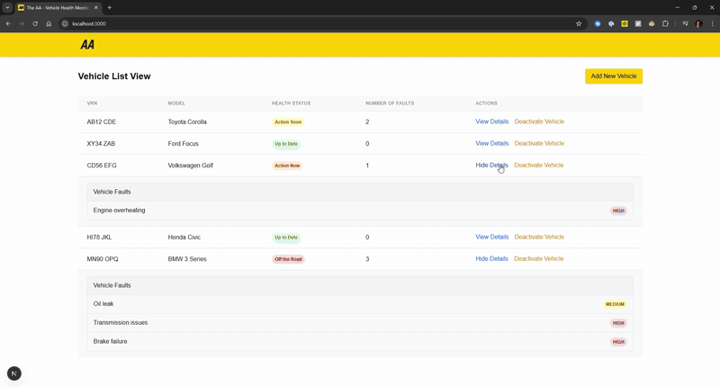

# TheAA Vehicle Health Monitoring System

A web application to monitor the health status of vehicles, developed with Spring Boot backend and Next.js frontend.



## Technology Stack

### Backend

- Java 21
- Spring Boot 3.4.5
- H2 Database (in-memory)
- JPA/Hibernate

### Frontend

- Next.js 15.3.1
- React 19.0.0
- TypeScript
- TanStack Query for data fetching
- Tailwind CSS for styling

## Installation and Setup

### Prerequisites

- Java 21 JDK
- Node.js 18+ and npm/yarn
- Maven 3.9+

### Backend Setup

1. Navigate to the backend directory:

   ```bash
   cd backend
   ```

2. Build the application:

   ```bash
   ./mvnw clean install
   ```

   or on Windows:

   ```bash
   mvnw.cmd clean install
   ```

3. Run the application:

   ```bash
   ./mvnw spring-boot:run
   ```

   or on Windows:

   ```bash
   mvnw.cmd spring-boot:run
   ```

The backend will start on <http://localhost:8080>.

### Frontend Setup

1. Navigate to the frontend directory:

   ```bash
   cd frontend
   ```

2. Install dependencies:

   ```bash
   npm install
   ```

   or

   ```bash
   yarn
   ```

3. Run the development server:

   ```bash
   npm run dev
   ```

   or

   ```bash
   yarn dev
   ```

The frontend will start on <http://localhost:3000>.

## Development Notes

- H2 Console is available at <http://localhost:8080/h2-console> when the backend is running
- Sample data is loaded on startup via `data.sql`

## Assumptions

- Deactivating a vehicle simply means deleting the vehicle from the database. In a production environment, there might be a deactivated vehicles database instead, with features of reactivation
- Issuing faults happen one at a time, no bulk faults
- Issuing faults occurs from different clients submitting `POST` requests, the user cannot submit faults from the browser
- Race conditions are ignored
- Faults are processed in a queue right away
- No internationalization for strings
- No dark mode
